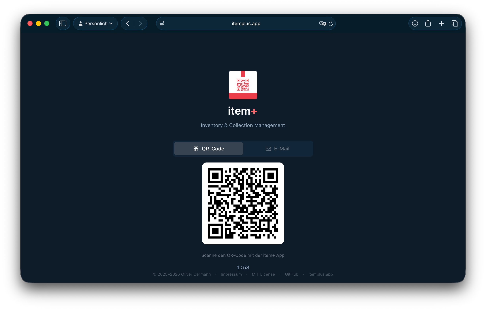
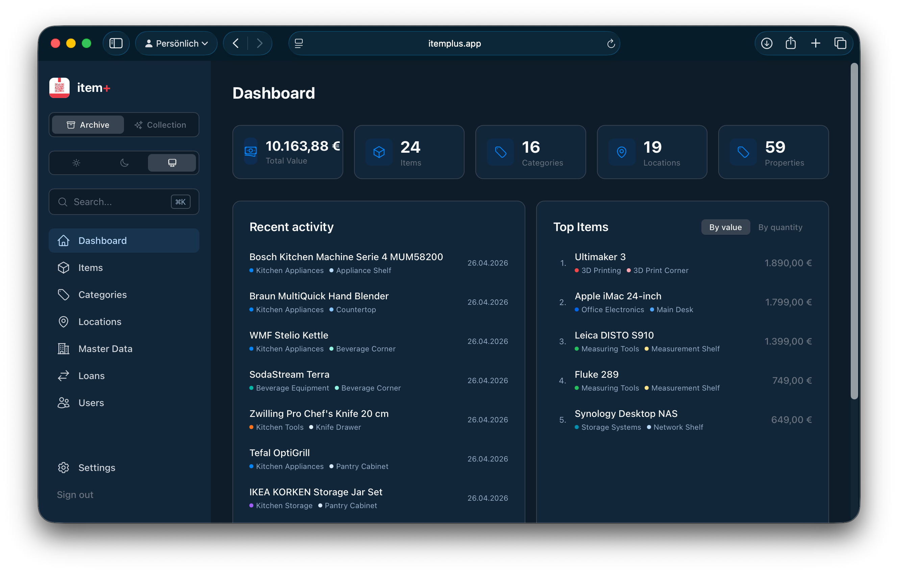
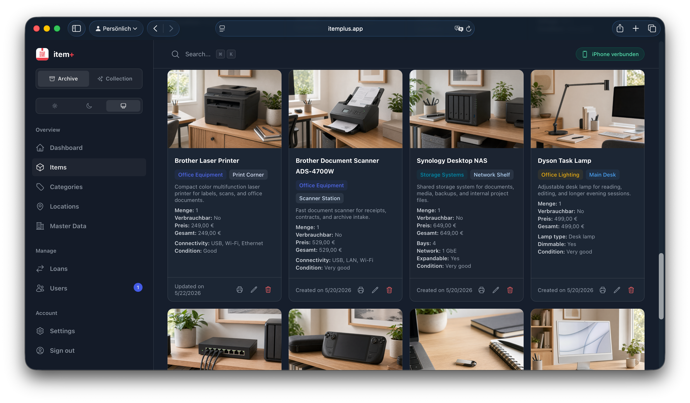
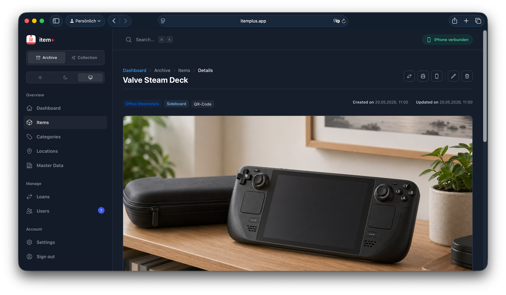
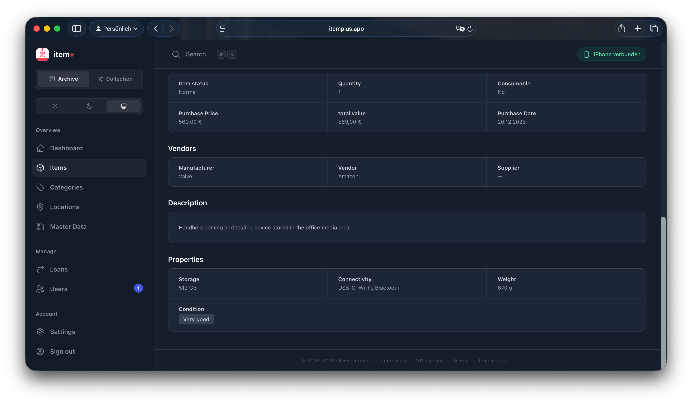
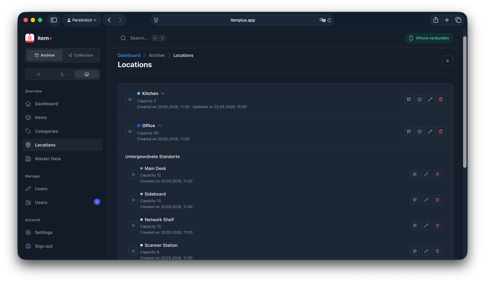
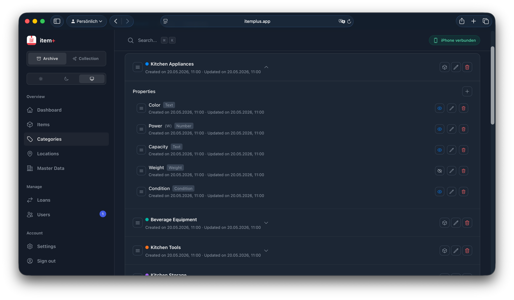
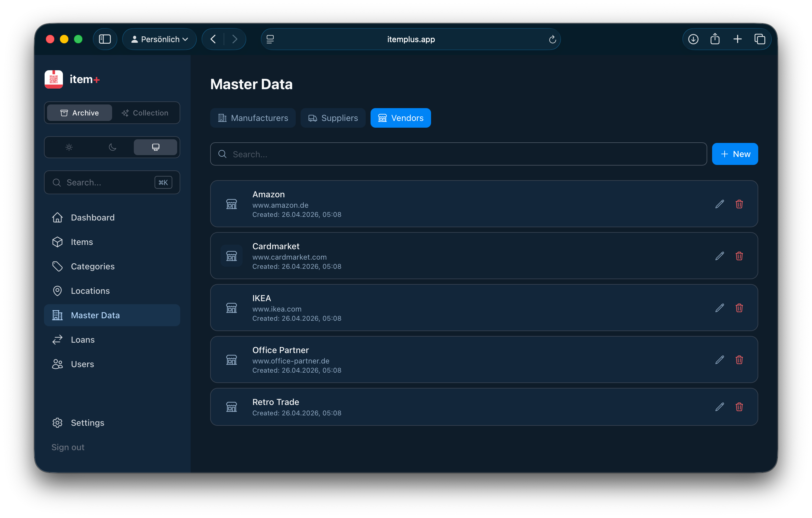
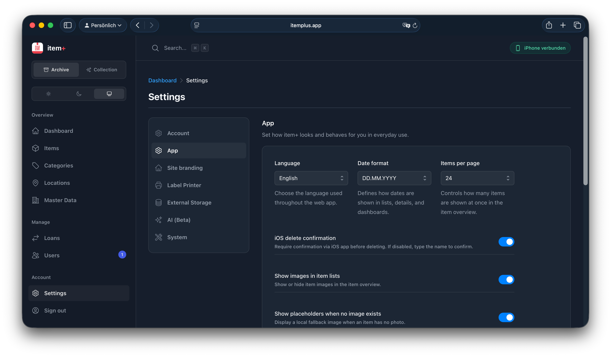

# item+


Open-source inventory and collection management for private households, collectors, and anyone who wants to keep track of their things without warehouse software, SaaS overhead, or ERP bloat.

item+ helps you keep track of what you own, where it lives, and who currently has it. It is built for people who want something more flexible than a notes app or spreadsheet, but much simpler than business software.

## What item+ is good at

- Catalog everyday items, gear, and collections in one app
- Keep archive-style inventory and collectible items separate, but consistent
- Create your own categories, locations, and custom properties instead of squeezing everything into a fixed schema
- Define item details the way they actually make sense for you, from dimensions and condition to ratings, priorities, or collector-specific fields
- Track value, notes, attachments, and where things are stored
- Manage lending and returns in a simple way
- Use QR labels, cross-device workflows, and optional thermal printing when you want them

## Screenshots

### First Look

| Login | Dashboard |
| --- | --- |
|  |  |

### Items and Details

| Items Grid | Item Detail A |
| --- | --- |
|  |  |

| Item Detail B | Categories |
| --- | --- |
|  |  |

### Structure and Settings

| Locations | Vendors |
| --- | --- |
|  |  |

| Settings |
| --- |
|  |

## Repository Layout

| Path | Purpose |
| --- | --- |
| `backend/go` | Main backend for everyday use, local installs, and packaged builds |
| `clients/web` | Main web interface |

The active backend on `main` is Go.

- Use `backend/go` for local installs, packaged builds, and deployment.
- Use `clients/web` as the main UI.

The iOS client is no longer shipped in this public repository.

## Quick Start

### Just run the binaries

If you do not want to set up Go, Node.js, or Xcode, use a release build.

```bash
./itemplus-server
```

That starts the backend and the embedded web app together.

On first start, item+ creates a local `itemplus.conf` automatically from `config/itemplus.conf`.

If you want to use the server without the embedded web app, for example while running the web client separately in development:

```bash
./itemplus-server --no-webapp
```

You can also override bind address and port:

```bash
./itemplus-server --bind 0.0.0.0 --port 17117
```

Or point item+ to an explicit config file:

```bash
./itemplus-server --config /etc/itemplus/itemplus.conf
```

You can also move uploads to a separate absolute storage path:

```bash
./itemplus-server --upload /opt/bigstorage/itemplus/uploads
```

Or override the database path directly at startup:

```bash
./itemplus-server --database sqlite+aiosqlite:///./data/itemplus.db
```

You can also move log files somewhere else:

```bash
./itemplus-server --logs ./logs
```

On Windows, the same flags work with Windows paths, for example:

```bash
itemplus-server.exe --upload "D:\\itemplus\\uploads"
itemplus-server.exe --database "sqlite+aiosqlite:///D:/itemplus/data/itemplus.db"
itemplus-server.exe --logs "D:\\itemplus\\logs"
```

If item+ runs behind a reverse proxy you control, you can also allow trusted
forwarded headers explicitly:

```bash
./itemplus-server --config /etc/itemplus/itemplus.conf
```

and then in `itemplus.conf`:

```conf
TRUSTED_PROXIES=127.0.0.1,::1
```

Leave `TRUSTED_PROXIES` empty when item+ is reachable directly. In that case,
item+ ignores forwarded client IP and protocol headers on purpose.

### Recommended: Go backend + web app

```bash
git clone https://github.com/dncloud/itemplus.git
cd itemplus/backend/go
go run . --bind 0.0.0.0 --port 17117
```

In a second terminal:

```bash
cd itemplus/clients/web
npm install
npm run dev
```

Open the web app at `http://127.0.0.1:3000`.

### Linux service

For a small Linux server or NAS, the usual production path is to download or build
`itemplus-server`, place it on the host, and run it behind nginx or Caddy.

item+ does not ship an installer or systemd unit. Linux service setup depends on
the distribution, filesystem layout, reverse proxy, backup strategy, and database
choice. If you use systemd, create your own unit and config file for your host.

A typical manual layout might be:

- binary: `/usr/local/bin/itemplus-server`
- config: `/etc/itemplus/itemplus.conf`
- data directory: `/var/lib/itemplus`
- uploads: `/var/lib/itemplus/uploads`
- logs: `/var/lib/itemplus/logs`

A minimal systemd `ExecStart` can look like this:

```ini
ExecStart=/usr/local/bin/itemplus-server --config /etc/itemplus/itemplus.conf
```

Then adjust `/etc/itemplus/itemplus.conf` for your domain, CORS, SMTP, database,
upload path, logs, and printer settings. Use `127.0.0.1` as the bind host when
the app sits behind a reverse proxy, or bind to `0.0.0.0` only when you
understand the network exposure.

Useful systemd commands, if you choose that setup:

```bash
systemctl status itemplus
journalctl -u itemplus -f
systemctl restart itemplus
```

### Web client only

```bash
cd itemplus/clients/web
npm install
npm run dev
```

The web client runs on `http://127.0.0.1:3000` and expects a backend on port `17117`.

## Configuration

The Go backend creates a local `itemplus.conf` automatically on first start from `config/itemplus.conf`.

Settings you will usually want to review:

- `APP_DOMAIN`
- `CORS_ORIGINS`
- `TRUSTED_PROXIES`
- SMTP settings for magic-link login
- `UPLOAD_DIR`

### Trusted reverse proxies

By default, item+ does **not** trust any reverse proxy headers.

That means:

- `X-Forwarded-For` is ignored unless you explicitly allow a proxy
- `X-Forwarded-Proto` is ignored unless you explicitly allow a proxy
- localhost-only setup mode and IP-based rate limits use the direct remote
  address by default

This is the safer default for self-hosted installs, especially when people bind
item+ to `0.0.0.0` without nginx or Caddy in front of it.

Only set `TRUSTED_PROXIES` when item+ really runs behind a reverse proxy that
you control.

Examples:

```conf
# Local nginx / Caddy on the same machine
TRUSTED_PROXIES=127.0.0.1,::1

# Internal reverse proxy networks
TRUSTED_PROXIES=10.0.0.0/8,192.168.0.0/16
```

If you are unsure, leave it empty.

### External attachments

Normal external attachment links are limited to `http://` and `https://`.

For non-HTTP storage such as SFTP, the recommended direction is not direct
client links, but a backend proxy flow:

`client <-> item+ <-> SFTP`

That design keeps authentication, access control, logging, and future caching
inside item+ instead of exposing storage credentials or raw server paths to the
client.

See also: [docs/sftp-external-storage.md](/Users/oli/Desktop/itemplus/docs/sftp-external-storage.md)

## Current State

item+ is already usable, but it is still evolving.

The core workflows are there, the apps work, and the project is actively being refined. Some areas, especially public-facing docs, curated demo content, and packaging details, are still being cleaned up.

## Support

If item+ is useful to you and you want to support ongoing work, you can do that via [GitHub Sponsors](https://github.com/sponsors/dncloud).

## License

Licensed under the [MIT License](LICENSE).
