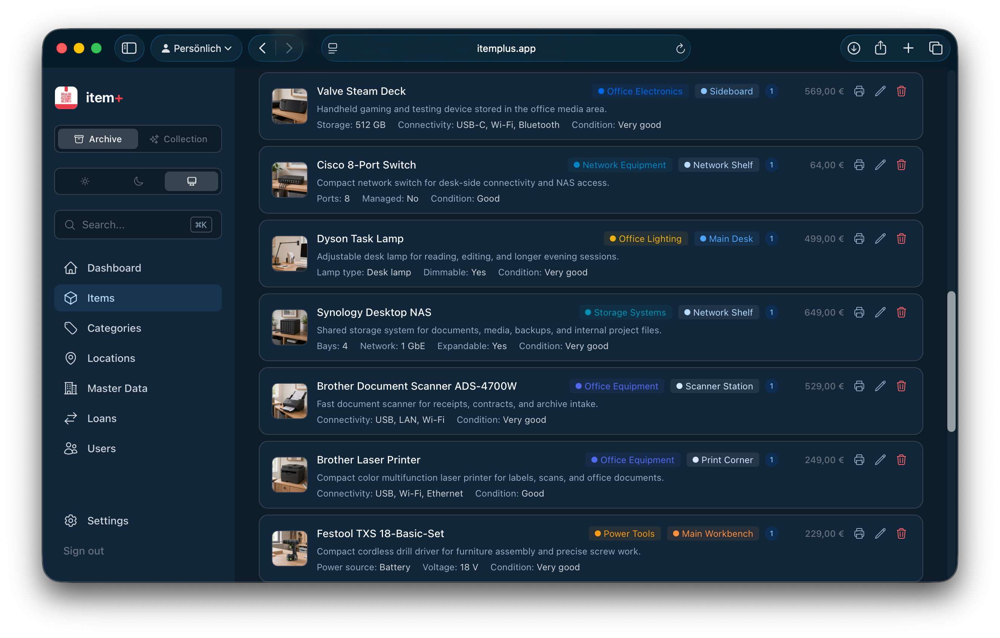
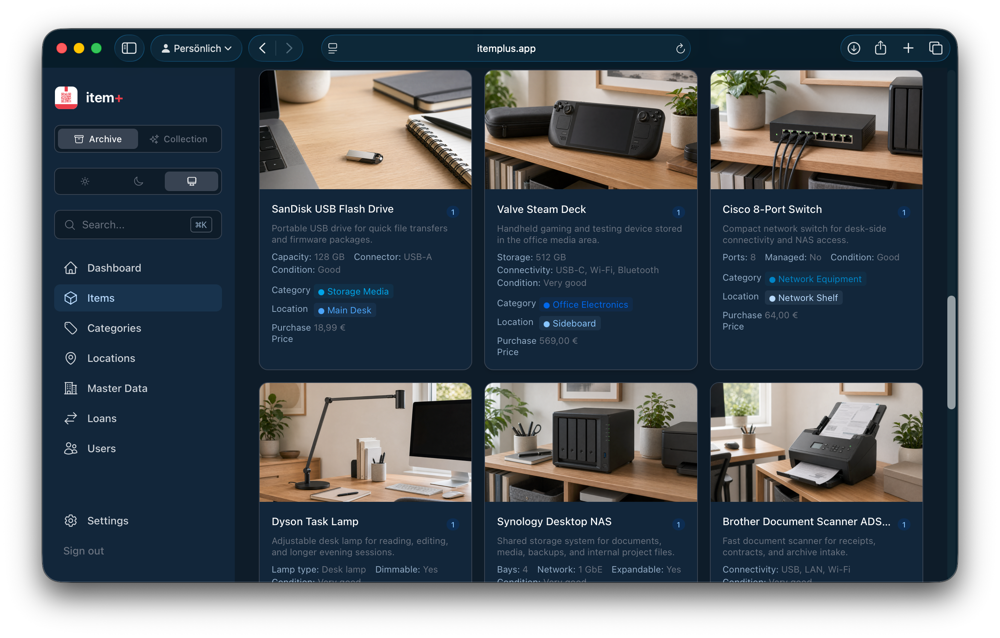
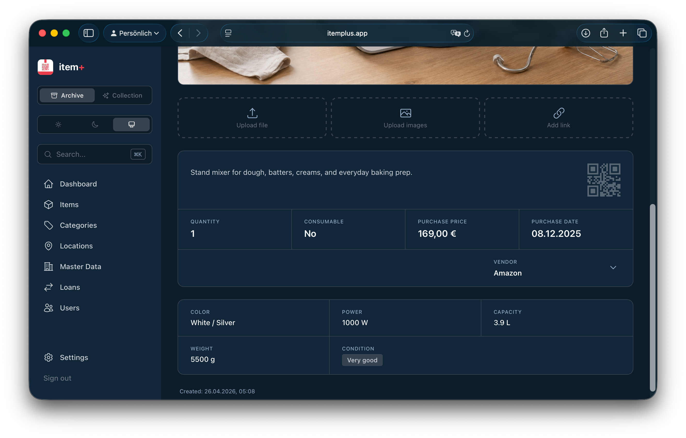

# item+


Open-source inventory and collection management for private households, collectors, and anyone who wants to keep track of their things without warehouse software, SaaS overhead, or ERP bloat.

item+ helps you keep track of what you own, where it lives, and who currently has it. It is built for people who want something more flexible than a notes app or spreadsheet, but much simpler than business software.

## What item+ is good at

- Catalog everyday items, gear, and collections in one app
- Keep archive-style inventory and collectible items separate, but consistent
- Create your own categories, locations, and custom properties instead of squeezing everything into a fixed schema
- Define item details the way they actually make sense for you, from dimensions and condition to ratings, priorities, or collector-specific fields
- Track value, notes, attachments, and where things are stored
- Manage lending and returns in a simple way
- Use QR labels, iPhone companion features, and optional thermal printing when you want them

## Screenshots

### First Look

| Login | Dashboard |
| --- | --- |
|  |  |

### Items and Details

| Items List | Items Grid |
| --- | --- |
|  |  |

| Item Detail | Categories |
| --- | --- |
|  |  |

### Structure and Settings

| Locations | Vendors |
| --- | --- |
|  |  |

| Settings |
| --- |
|  |

## Repository Layout

| Path | Purpose |
| --- | --- |
| `backend/go` | Main backend for everyday use, local installs, and packaged builds |
| `clients/web` | Main web interface |
| `clients/ios` | iPhone companion app for scanning, photos, approvals, and QR-based workflows |

The Go backend is the primary and only actively maintained backend on `main`.

- Use `backend/go` for local installs, packaged builds, and production use.
- Use `clients/web` with the Go backend.
- Use `clients/ios` as an optional companion to the web app.
- The former Python backend has been preserved on the `legacy/python-backend` branch.

## Quick Start

### Just run the binaries

If you do not want to set up Go, Node.js, or Xcode, use a release build.

```bash
./itemplus-server
```

That starts the backend and the embedded web app together.

On first start, item+ creates a local `.env` automatically from `config/default.env`.

If you want demo data too:

```bash
./itemplus-seed --reset
```

If you want to use the server without the embedded web app, for example while running the web client separately in development:

```bash
./itemplus-server --no-webapp
```

You can also override bind address and port:

```bash
./itemplus-server --bind 0.0.0.0 --port 8000
```

### Recommended: Go backend + web app

```bash
git clone https://github.com/dncloud/itemplus.git
cd itemplus/backend/go
go run . --bind 0.0.0.0 --port 8000
```

In a second terminal:

```bash
cd itemplus/clients/web
npm install
npm run dev
```

Open the web app at `http://127.0.0.1:3000`.

### Web client only

```bash
cd itemplus/clients/web
npm install
npm run dev
```

The web client runs on `http://127.0.0.1:3000` and expects a backend on port `8000`.

### iPhone companion app

Open this project in Xcode:

```text
clients/ios/itemplus.xcodeproj
```

The iPhone app works as a companion to the web app for scanning, photos, QR-based login, and other cross-device actions. It requires iOS 17+ and a running backend the phone can reach.

## Configuration

The Go backend creates a local `.env` automatically on first start from `config/default.env`.

Settings you will usually want to review:

- `APP_DOMAIN`
- `CORS_ORIGINS`
- `APPLE_BUNDLE_ID`
- SMTP settings for magic-link login
- `UPLOAD_DIR`

## Current State

item+ is already usable, but it is still evolving.

The core workflows are there, the apps work, and the project is actively being refined. Some areas, especially public-facing docs, curated demo content, and packaging details, are still being cleaned up.

## Support

If item+ is useful to you and you want to support ongoing work, you can do that via [GitHub Sponsors](https://github.com/sponsors/dncloud).

## License

Licensed under the [MIT License](LICENSE).
